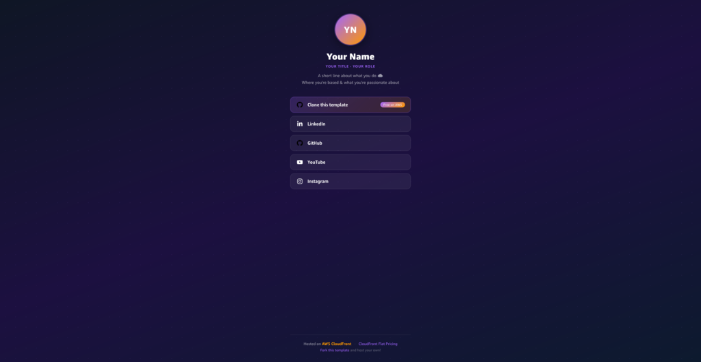
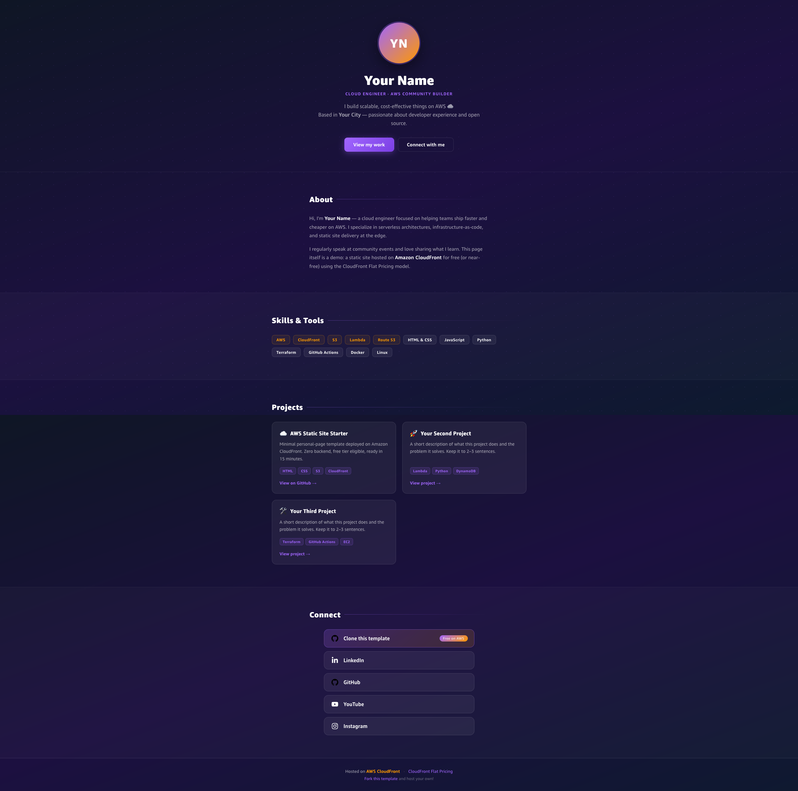

# AWS Static Site Starter

> **From the talk: *Your First Website on AWS — CloudFront Flat Pricing***

Minimal, clean static-site templates designed to be deployed on **Amazon CloudFront** in under 15 minutes. No backend, no server, no surprises — just HTML, CSS, and cloud.

**Live demo:** the page you're looking at right now, served from CloudFront. Fork it and make it yours.

---

## 📸 Preview

| Link page (`index.html`) | Portfolio (`index-portfolio.html`) |
|:---:|:---:|
|  |  |

---

## ✨ What's included

Two ready-to-use templates — pick the one that fits you:

| Template | File | Best for |
|----------|------|----------|
| **Link page** | `index.html` | A clean "link in bio" / social hub |
| **Portfolio** | `index-portfolio.html` | A full one-page portfolio with About, Skills, Projects & Connect |

Both share the same dark AWS-themed design. Just rename whichever you want as your `index.html` (or use both).

| Before | After |
|--------|-------|
| An S3 bucket with a static file | A globally distributed website behind a CDN |
| Manual uploads | Optional CI/CD with GitHub Actions |
| Plain HTTP | HTTPS out of the box |

---

## 🚀 Deploy in 15 minutes

### Prerequisites

- An [AWS account](https://aws.amazon.com/free/) — free tier is enough
- A browser (no CLI required for the basic setup)
- A domain name (you can buy one in Route 53)

### Step 1 — Fork & customize

1. **Fork** this repository (or click *Use this template* → *Create a new repository*)
2. Edit `index.html`:
   - Replace `Your Name`, `Your Title · Your Role`, and the bio with your own text
   - Update every `href="#your-*-url"` with your real social / link URLs
   - Drop your photo in as `assets/avatar.png` (~400×400 px recommended)
3. Edit `assets/site.webmanifest`:
   - Set `name` and `short_name` to your own name or site title
4. Optionally tweak colors in `assets/style.css` (see the `--accent-*` variables at the top)

### Step 2 — Create an S3 bucket

1. Open the [S3 console](https://s3.console.aws.amazon.com/) → **Create bucket**
2. Give it any name (e.g. `my-personal-site`)
3. In *Block Public Access*, **check** "Block all public access" and confirm
4. Upload all files, preserving the `assets/` folder structure

### Step 3 — Create a CloudFront distribution

1. Open the [CloudFront console](https://console.aws.amazon.com/cloudfront/) → **Create distribution**
2. Select **Flat Pricing** (the Free Plan)
3. **Origin domain** → select your S3 bucket's *website endpoint* (ends in `.s3-website-…`)
4. **Default root object** → `index.html`
5. **Viewer protocol policy** → *Redirect HTTP to HTTPS*
6. Click **Create distribution** — it takes ~5 minutes to deploy globally

### Step 4 — Visit your site 🎉

Your site is live at both the CloudFront URL, e.g. `d1234abcdef.cloudfront.net` and the custom domain you used in the distribution creation.

If you skipped the setting up the domain you can later add one as an **Alternate domain name** in the distribution settings.

---

## 💰 Pricing

This template uses **CloudFront Flat Pricing** — a model that bundles the CDN with WAF, DDoS protection, Route 53 DNS, a free TLS certificate, S3 storage credits, and edge compute into a single flat monthly price with **no overages**, even during traffic spikes or attacks.

There are four tiers. A personal site runs comfortably on the **Free plan**:

| Plan | Price | Requests/mo | Data transfer/mo | S3 storage credit |
|------|-------|-------------|-----------------|-------------------|
| **Free** | **$0** | 1 million | 100 GB | 5 GB |
| Pro | $15 | 10 million | 50 TB | 50 GB |
| Business | $200 | 125 million | 50 TB | 1 TB |
| Premium | $1,000 | 500 million | 50 TB | 5 TB |

**What's always free on top of your plan:**  
Data transfer between S3 (or any AWS origin) and CloudFront is never charged — you only pay for delivery to end users, and on the Free plan that's covered too.

**No annual commitment** — start on Free, upgrade any time.

→ [CloudFront Flat Pricing details](https://aws.amazon.com/cloudfront/pricing/)  
→ [Flat-rate pricing plan docs](https://docs.aws.amazon.com/AmazonCloudFront/latest/DeveloperGuide/flat-rate-pricing-plan.html)

---

## 🛠️ Tech stack

| Layer | Technology |
|-------|------------|
| Markup | HTML5 (semantic) |
| Styles | CSS3 — base + portfolio (no framework required) |
| Fonts | Amazon Ember (included in `assets/`) |
| CDN | Amazon CloudFront |
| Storage | Amazon S3 |
| CI/CD | GitHub Actions *(optional)* |

---

## 📁 Project structure

```
aws-static-site-starter/
├── index.html               ← Link page — social hub / linktree style
├── index-portfolio.html     ← Portfolio page — About, Skills, Projects, Connect
├── assets/
│   ├── style.css            ← Shared base styles (colors, fonts, link cards)
│   ├── portfolio.css        ← Portfolio-specific styles (Hero, sections, grid)
│   ├── avatar.png           ← Your photo (add this file, ~400×400 px)
│   ├── ember-*.ttf          ← Amazon Ember fonts
│   ├── *-brands-solid.svg   ← Social media icons
│   ├── favicon.svg          ← Favicon — replace with your own SVG or image
│   └── site.webmanifest     ← PWA manifest — update name/short_name
└── README.md
```

---

## ✏️ Customization checklist

### Both pages
- [ ] Add `assets/avatar.png` (your photo, ~400×400 px)
- [ ] Replace every `href="#your-*-url"` with your real social URLs
- [ ] Update `name` and `short_name` in `assets/site.webmanifest`
- [ ] *(Optional)* Replace `assets/favicon.svg` with your own icon
- [ ] *(Optional)* Adjust `--accent-purple` / `--accent-orange` in `style.css`

### Link page (`index.html`)
- [ ] Update `<title>` and `<meta name="description">`
- [ ] Change `Your Name`, `Your Title · Your Role`, and bio text
- [ ] Update avatar initials (`YN` → your own)

### Portfolio page (`index-portfolio.html`)
- [ ] Update `<title>` and `<meta name="description">`
- [ ] Change `Your Name`, `Your Role`, and hero bio
- [ ] Edit the **About** section paragraphs
- [ ] Update the **Skills** chip list to match your stack
- [ ] Replace the three **Project** cards with your real projects
- [ ] Update avatar initials (`YN` → your own)

---

## 📄 License

[MIT](LICENSE) — free to use, fork, and customize. A mention or star is appreciated but not required.

---

Made with ☁️ by [marianord](https://marianord.com) · Powered by [AWS CloudFront](https://aws.amazon.com/cloudfront/)
